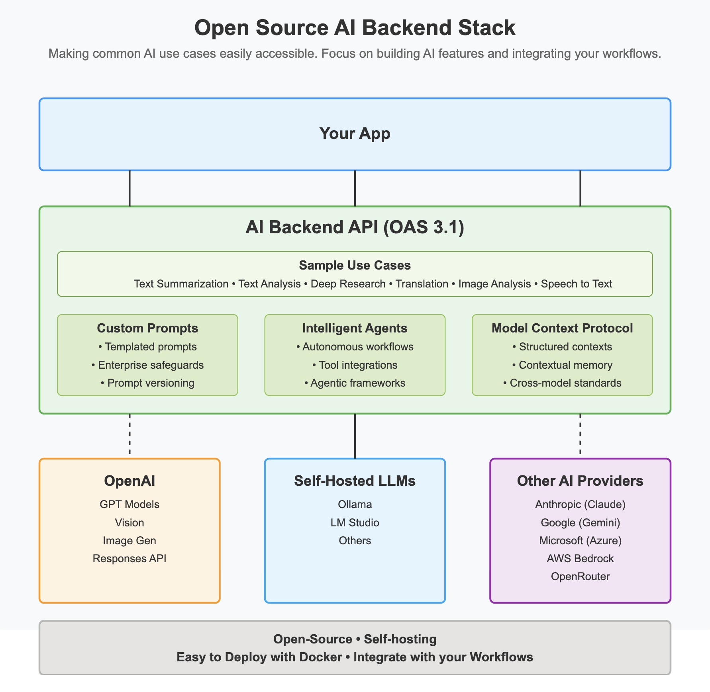
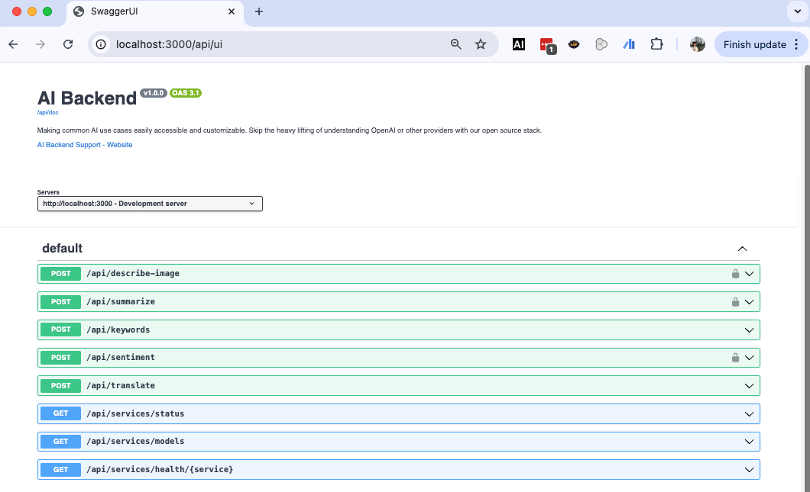

# AIBackends

AIBackends is an API server that you can use to integrate AI into your applications. It is a turnkey and cost effective solution for your AI integration needs. 

The project supports open source models using Ollama. It also supports cloud models from OpenAI and Anthropic.

## Purpose of the project

The purpose of this project is to make common AI use cases easily accessible to developers. To implement common AI use cases, you need to understand prompt engineering and API integration with different AI providers. This project aims to skip that learning curve so developers can focus on integrating AI into applications and automation workflows.



## Architecture and Tech Stack

- Hono for the API server
- Typescript
- Zod for request and response validation
- Vercel AI SDK for AI integration
- Docker for containerization

## Supported LLM Providers

- Ollama for local models (self-hosted)
- OpenAI for GPT models (cloud-based)
- Anthropic for Claude models (cloud-based)
- OpenRouter for multiple open source and private models (coming soon)
- Google for Gemini models (coming soon)

## Available Endpoints

- **/api/summarize**: Summarize text
- **/api/translate**: Translate text
- **/api/sentiment**: Analyze sentiment
- **/api/keywords**: Extract keywords
- **/api/describe-image**: Describe an image
- More to come...check swagger docs for updated endpoints.


## Environment Setup

Create a `.env` file in the root directory of this project and configure your preferred AI services:

```env
# General Configuration
DEFAULT_ACCESS_TOKEN=your-secret-api-key

# CORS Configuration
CORS_ALLOWED_ORIGINS=http://localhost:3000,https://example.com,https://*.example.com

# OpenAI Configuration
OPENAI_API_KEY=your-openai-api-key

# Anthropic Configuration
ANTHROPIC_API_KEY=your-anthropic-api-key

# Ollama Configuration
OLLAMA_ENABLED=true
OLLAMA_BASE_URL=http://localhost:11434
OLLAMA_TIMEOUT=30000

# You can change OLLAMA_BASE_URL to use a remote Ollama instance if you want.
```

**Important:** Make sure to add `.env` to your `.gitignore` file to avoid committing sensitive information to version control.

## Development

```bash
# Install dependencies
bun install

# Run in development mode and bypasses access token check in the API, do run using this command in production. Always use production when deploying so access token is required.
NODE_ENV=development bun run dev

# Build for production
bun run build
```

## Swagger Documentation available 
 `http://localhost:3000/api/ui`


## Provider and Model Selection
You need to send the service and model name in the request body. See examples in the swagger docs.

For example, to summarize text using qwen2.5-coder model with Ollama as provider, you can use the following curl command:

```curl
curl --location 'http://localhost:3000/api/summarize' \
--header 'Content-Type: application/json' \
--header 'Accept: application/json' \
--data '{
    "payload": {
        "text": "Text to summarize",
        "maxLength": 100
    },
    "config": {
        "provider": "ollama",
        "model": "qwen2.5-coder",
        "temperature": 0
    }
}'
```

## Available Tools
- Home Page: `http://localhost:3000/`
- Swagger Docs: `http://localhost:3000/api/ui`. You can test the API endpoints here.
- JSON Editor: `http://localhost:3000/api/jsoneditor`

## Testing Examples

Check swagger docs for examples.

The project is in active development. More endpoints and providers will be added in the future. If you want to support me with API credits from your provider, please contact me.

I am also open to sponsorship to support the development of the project.