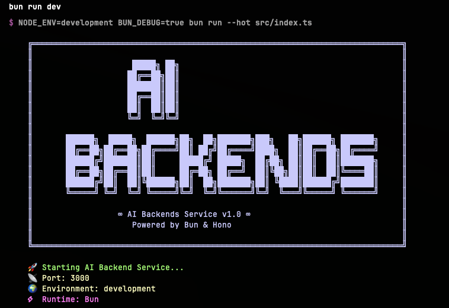
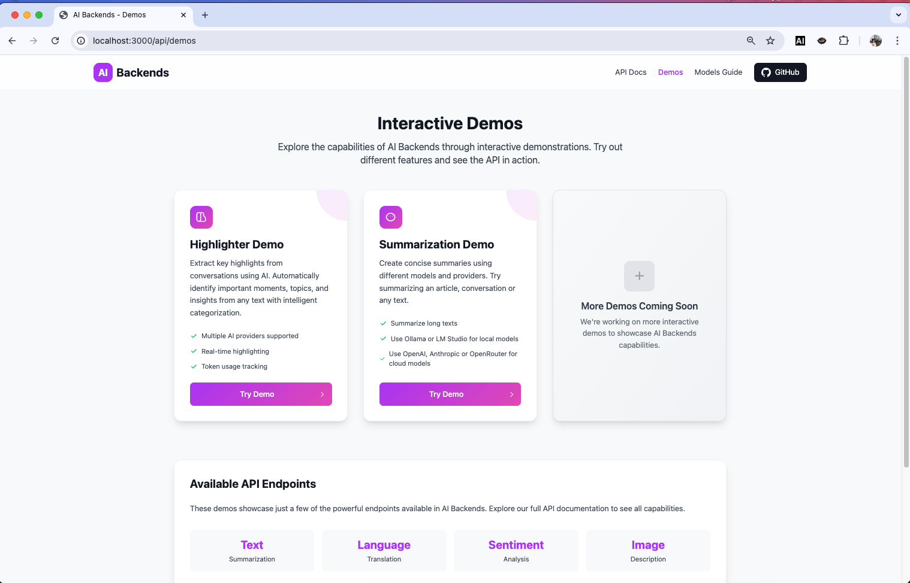
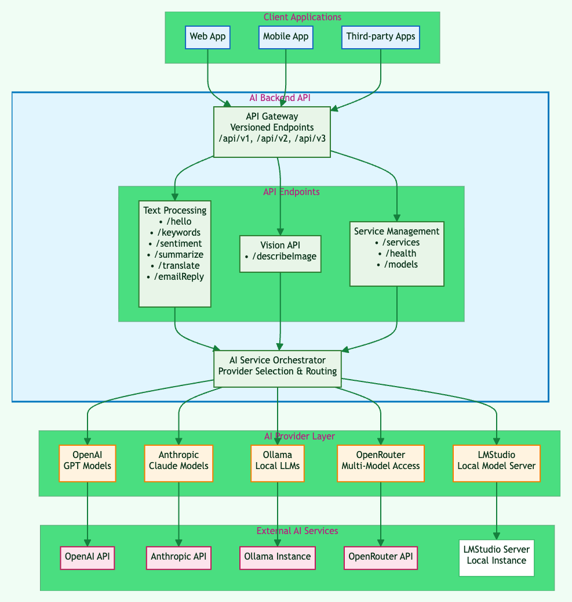

# AI Backends

AIBackends is an API server that you can use to integrate AI into your applications. You can run it locally or self-host it.

The project supports running open source models locally with Ollama and LM Studio. It also supports OpenRouter, OpenAI and Anthropic.

## Why AI Backends?

The purpose of this project is to make common AI use cases easily accessible to non-coders who want to add AI features to their applications. AIBackends have been tested with popular AI app builder tools like [Bolt.new](https://bolt.new), [v0](https://v0.dev) and [Lovable](https://lovable.dev). You can also use it with [Warp](https://warp.dev), [Cursor](https://cursor.com/), [Claude Code](https://www.anthropic.com/claude-code), [Windsurf](https://windsurf.com/) or [AmpCode](https://ampcode.com/).

Since APIs are ready to use, you don't need to understand prompt engineering. Just prompt the API documentation and you are good to go. For those who want use with online app builders, you need to host AIBackends on your own server. I have tested in Railway and it is a good option.



## Available APIs

### Text Processing
| Endpoint | Description |
|----------|-------------|
| **/api/summarize** | Summarize long text content into concise, key points |
| **/api/translate** | Translate text between different languages |
| **/api/sentiment** | Analyze the emotional tone and sentiment of text |
| **/api/keywords** | Extract important keywords and phrases from text |
| **/api/email-reply** | Generate professional email responses based on context |
| **/api/ask-text** | Ask questions about provided text and get intelligent answers |
| **/api/highlighter** | Identify and highlight the most important information in text |
| **/api/meeting-notes** | Transform meeting notes into structured summaries |
| **/api/project-planner** | Create detailed project plans with steps, timelines, and considerations |

### Image Processing

| Endpoint | Description |
|----------|-------------|
| **/api/describe-image** | Describe an image (work in progress) |

More to come...check swagger docs for updated endpoints.

## Supported LLM Providers

| Provider | Description | Status |
|----------|-------------|--------|
| [Ollama](https://ollama.ai/) | Local models (self-hosted) |  Available |
| [LM Studio](https://lmstudio.ai/) | Local models via OpenAI-compatible API (self-hosted) | Available |
| [OpenAI](https://openai.com/) | GPT models | Available |
| [Anthropic](https://www.anthropic.com/) | Claude models | Available |
| [OpenRouter](https://openrouter.ai/) | Open source and private models |  Available |
| [Vercel AI Gateway](https://vercel.com/ai) | Open source and private models | In Progress |
| [Google](https://ai.google.dev/) | Gemini models | In Progress |


## Run the project

You can configure API keys for different AI providers in the `.env` file.

```bash
# Install dependencies
bun install

# Run in development mode and bypasses access token check in the API, do run using this command in production. Always use production when deploying so access token is required. NODE_ENV=development is set in package.json when you run in development mode.
bun run dev

# Build for production
bun run build
```

## Set up environment variables

Create a `.env` file in the root directory of this project and configure your preferred AI services:

```env
# General Configuration
DEFAULT_ACCESS_TOKEN=your-secret-api-key

# CORS Configuration
CORS_ALLOWED_ORIGINS=http://localhost:3000,https://example.com,https://*.example.com

# OpenAI Configuration
OPENAI_API_KEY=your-openai-api-key

# Anthropic Configuration
ANTHROPIC_API_KEY=your-anthropic-api-key

# Ollama Configuration
OLLAMA_ENABLED=true
OLLAMA_BASE_URL=http://localhost:11434
OLLAMA_TIMEOUT=30000

# You can change OLLAMA_BASE_URL to use a remote Ollama instance
 
# LM Studio Configuration 
LMSTUDIO_ENABLED=true
LMSTUDIO_BASE_URL=http://localhost:1234

# You can change LMSTUDIO_BASE_URL to use a remote LM Studio instance
```

**Important:** Make sure to add `.env` to your `.gitignore` file to avoid committing sensitive information to version control.


## Tech Stack

- Hono for the API server
- Typescript
- Zod for request and response validation
- Vercel AI SDK for AI integration
- Docker for containerization


## Swagger Docs

After running the project, you can access the swagger docs at:

`http://localhost:3000/api/ui`


## Demos

See examples how to use the APIs

You can access demos at http://localhost:3000/api/demos




## Provider and Model Selection
You need to send the service and model name in the request body. See examples in the swagger docs.

For example, to summarize text using qwen2.5-coder model with Ollama as provider, you can use the following curl command:

```curl
curl --location 'http://localhost:3000/api/v1/summarize' \
--header 'Content-Type: application/json' \
--header 'Accept: application/json' \
--data '{
    "payload": {
        "text": "Text to summarize",
        "maxLength": 100
    },
    "config": {
        "provider": "ollama",
        "model": "gemma3:4b",
        "temperature": 0
    }
}'
```

## Available Tools
- Home Page: `http://localhost:3000/`
- Swagger Docs: `http://localhost:3000/api/ui`. You can test the API endpoints here.
- JSON Editor: `http://localhost:3000/api/jsoneditor`

## Testing Examples

Check swagger docs for examples.

The project is in active development. More endpoints and providers will be added in the future. If you want to support me with API credits from your provider, please contact me.

I am also open to sponsorship to support the development of the project.

## Vision


## Technical Architecture



## Star History

[](https://www.star-history.com/#donvito/ai-backends&Date)

## Supporting the project
You can support my AI Backends project by becoming a Github Sponsor.