# AI Backend Architecture Diagram

## Overview

This document contains the comprehensive architecture diagram for the AI Backend system, showing all implemented features, services, and their relationships.

## Architecture Diagram

```mermaid
graph TB
    %% Client Layer
    Client[Client Applications]
    
    %% API Gateway Layer
    subgraph apiLayer ["HonoJS API Server"]
        Gateway[API Gateway<br/>OpenAPI/Swagger]
        Auth[Bearer Auth<br/>Middleware]
        CORS[CORS<br/>Middleware]
        Security[Security Headers<br/>Middleware]
    end
    
    %% Route Layer
    subgraph routeLayer [" API Routes (/api/...)"]
        Health["/hello<br/>Health Check"]
        Services["/services<br/>Service Management"]
        
        subgraph textProcessing ["Text Processing"]
            Summarize["/summarize<br/>Text Summarization"]
            Sentiment["/sentiment<br/>Sentiment Analysis"]
            Keywords["/keywords<br/>Keyword Extraction"]
            Translate["/translate<br/>Translation"]
            Tweet["/tweet<br/>Tweet Generation"]
        end
        
        subgraph imageProcessing ["Image Processing"]
            DescribeImg["/describeImage<br/>Image Description"]
        end
        
        subgraph devTools ["Developer Tools"]
            JsonEditor["/jsoneditor<br/>JSON Editor"]
        end
    end
    
    %% Service Orchestration Layer
    subgraph orchestratorLayer ["AI Service Orchestrator"]
        ServiceManager[AI Service Manager<br/>• Auto-selection<br/>• Failover<br/>• Health checks]
        ResponseGen[Response Generator<br/>• Schema validation<br/>• Token usage tracking]
    end
    
    %% AI Provider Layer
    subgraph aiLayer ["AI Providers"]
        subgraph priority1 ["Priority 1"]
            OpenAI[OpenAI<br/>GPT-4.1<br/>• Text processing<br/>• API key auth]
        end
        
        subgraph priority2 ["Priority 2"]
            Anthropic[Anthropic<br/>Claude-3.5-Sonnet<br/>• Text processing<br/>• API key auth]
        end
        
        subgraph priority3 ["Priority 3"]
            Ollama[Ollama<br/>Local Models<br/>• Text processing<br/>• Vision capabilities<br/>• Health monitoring]
        end
    end
    
    %% Configuration Layer
    subgraph configLayer ["Configuration"]
        EnvConfig[Environment Variables<br/>• API keys<br/>• Model settings<br/>• Service URLs]
        ServiceConfig[Service Configuration<br/>• Priority settings<br/>• Availability checks]
    end
    
    %% Utilities Layer
    subgraph utilLayer ["Utilities"]
        ErrorHandler[Error Handler<br/>• Validation<br/>• HTTP responses]
        Prompts[Prompt Templates<br/>• Task-specific prompts]
        ApiDocs[API Documentation<br/>• OpenAPI schema<br/>• Swagger UI<br/>• ReDoc]
    end
    
    %% Data Flow
    Client --> Gateway
    Gateway --> Auth
    Auth --> CORS
    CORS --> Security
    Security --> Health
    Security --> Services
    Security --> Summarize
    Security --> Sentiment
    Security --> Keywords
    Security --> Translate
    Security --> Tweet
    Security --> DescribeImg
    Security --> JsonEditor
    
    %% Route to Service Connections
    Summarize --> ServiceManager
    Sentiment --> ServiceManager
    Keywords --> ServiceManager
    Translate --> ServiceManager
    Tweet --> ServiceManager
    DescribeImg --> ServiceManager
    Services --> ServiceManager
    
    ServiceManager --> ResponseGen
    
    %% AI Provider Connections
    ResponseGen --> OpenAI
    ResponseGen --> Anthropic
    ResponseGen --> Ollama
    
    %% Configuration Connections
    ServiceManager --> ServiceConfig
    ServiceConfig --> EnvConfig
    
    %% Utility Connections
    ServiceManager --> ErrorHandler
    ServiceManager --> Prompts
    Gateway --> ApiDocs
    
    %% Individual Node Styling
    classDef client fill:#FF6B6B,stroke:#D63031,stroke-width:3px,color:#fff
    classDef apiNodes fill:#4ECDC4,stroke:#00B894,stroke-width:3px,color:#fff
    classDef routeCore fill:#45B7D1,stroke:#0984e3,stroke-width:2px,color:#fff
    classDef routeText fill:#96CEB4,stroke:#55A3FF,stroke-width:2px,color:#2d3436
    classDef routeImage fill:#FFEAA7,stroke:#FDCB6E,stroke-width:2px,color:#2d3436
    classDef routeTools fill:#DDA0DD,stroke:#9B59B6,stroke-width:2px,color:#fff
    classDef orchestrator fill:#FF7675,stroke:#E17055,stroke-width:3px,color:#fff
    classDef aiOpenAI fill:#00D2D3,stroke:#00B894,stroke-width:3px,color:#fff
    classDef aiAnthropic fill:#FF9FF3,stroke:#F368E0,stroke-width:3px,color:#fff
    classDef aiOllama fill:#FFB8B8,stroke:#FF6B6B,stroke-width:3px,color:#fff
    classDef config fill:#A8E6CF,stroke:#00B894,stroke-width:2px,color:#2d3436
    classDef utilities fill:#FFD93D,stroke:#F39C12,stroke-width:2px,color:#2d3436
    
    %% Section Background Colors
    classDef apiSection fill:#E8F8F5,stroke:#26A085,stroke-width:4px
    classDef routeSection fill:#EBF3FD,stroke:#3498DB,stroke-width:4px
    classDef textSection fill:#E8F5E8,stroke:#27AE60,stroke-width:3px
    classDef imageSection fill:#FFF3CD,stroke:#F39C12,stroke-width:3px
    classDef toolSection fill:#F4E6FF,stroke:#9B59B6,stroke-width:3px
    classDef orchestratorSection fill:#FFEBEE,stroke:#E74C3C,stroke-width:4px
    classDef aiSection fill:#F3E5F5,stroke:#8E44AD,stroke-width:4px
    classDef priority1Section fill:#E0F7FA,stroke:#00BCD4,stroke-width:3px
    classDef priority2Section fill:#FCE4EC,stroke:#E91E63,stroke-width:3px
    classDef priority3Section fill:#FFF0F5,stroke:#FF69B4,stroke-width:3px
    classDef configSection fill:#E8F5E8,stroke:#4CAF50,stroke-width:4px
    classDef utilSection fill:#FFFBF0,stroke:#FF9800,stroke-width:4px
    
    %% Apply Node Classes
    class Client client
    class Gateway,Auth,CORS,Security apiNodes
    class Health,Services routeCore
    class Summarize,Sentiment,Keywords,Translate,Tweet routeText
    class DescribeImg routeImage
    class JsonEditor routeTools
    class ServiceManager,ResponseGen orchestrator
    class OpenAI aiOpenAI
    class Anthropic aiAnthropic
    class Ollama aiOllama
    class EnvConfig,ServiceConfig config
    class ErrorHandler,Prompts,ApiDocs utilities
    
    %% Apply Section Background Classes
    class apiLayer apiSection
    class routeLayer routeSection
    class textProcessing textSection
    class imageProcessing imageSection
    class devTools toolSection
    class orchestratorLayer orchestratorSection
    class aiLayer aiSection
    class priority1 priority1Section
    class priority2 priority2Section
    class priority3 priority3Section
    class configLayer configSection
    class utilLayer utilSection
```

*Generated on: 30-07-2025*
*Last Updated: 30-07-2025*